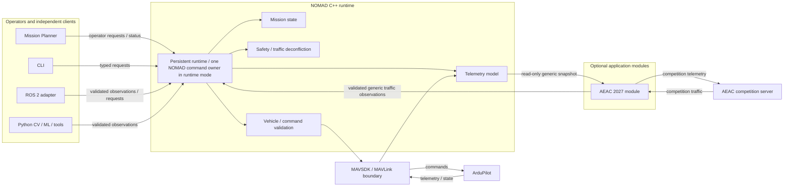
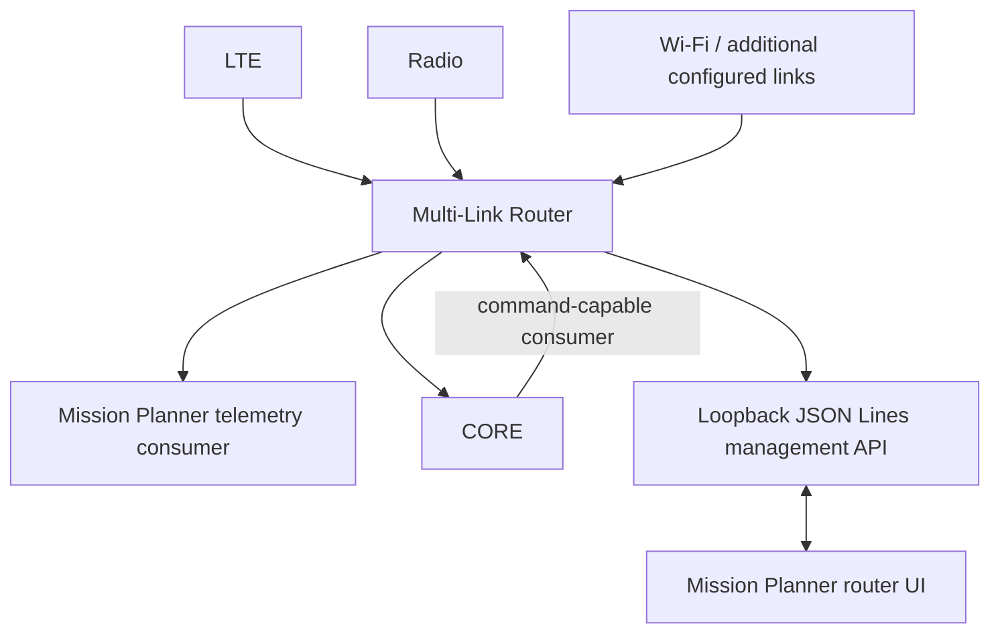
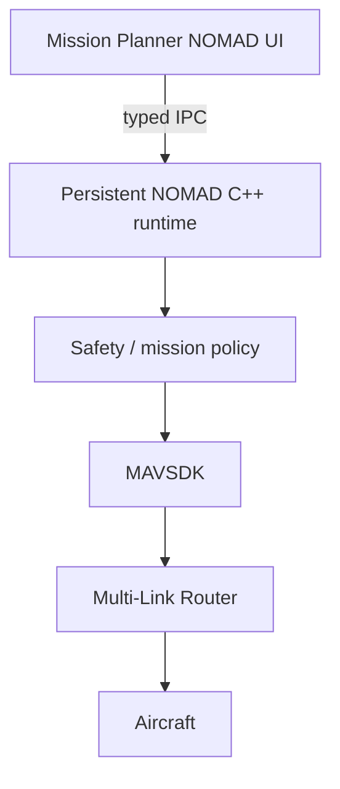

# Architecture

Target design reconciled to CONOPS v1.0, 2026-09-10. Requirements and pending decisions are in
[PRD](prd.md); implementation and discrepancy records are in [migration](migration.md),
with current qualification scope in the [status matrix](migration.md#current-qualification-status).
The AEAC-specific external contract is in [AEAC 2027 integration](aeac-2027.md).
The working tree already removes Edge Core. Removal is not proof of a complete
replacement deployment.

## Ownership and runtime boundary

The diagram is a target ownership view, not a claim that every boundary is
implemented today. The persistent runtime and versioned local IPC foundation
exist; mission supervision, AEAC integration, ROS migration and full client
migration remain open. ArduPilot owns stabilization, motor control, EKF, low-level
navigation and failsafes. The competition termination mechanism belongs on the
aircraft, with independently qualified safety hardware/ArduPilot behavior even
when the C++ core or ground link is unavailable. C++ verifies
configuration/readiness and exposes outcomes; Mission Planner requests and
displays, never owns parallel termination parameter policy. All-mode containment,
100 m AGL and five-second termination entry require separate evidence.
Hard-boundary violation is the termination trigger (U-FEN-01); Q02 still blocks
final aircraft-phase termination design. This architecture does not prescribe a
new kill command or failsafe override.

The C++ core owns high-level mission behavior, command validation,
traffic response decisions, payload authorization and authoritative outcome
tracking. Perception produces observations; it does not directly steer vehicles.

### Aircraft operation capabilities

Aircraft recognition and operation qualification are separate decisions. The
heartbeat and required parameters select `Copter`, `Plane`, `QuadPlane` or
`Unknown`; `VehicleOperation` and `supports_operation` then apply the reviewed
per-operation policy before any command, setpoint or configuration request can
reach the transport. The policy fails closed: a new or unresolved aircraft class
has no aircraft-dependent capability until a test and evidence update explicitly
add it. MAVLink command availability and an accepted ACK are not qualification.
Semantic operations gate once and then use private transport helpers; for
example, `set_guided_mode` does not also require the arbitrary `SetMode`
capability. This permits a narrow operation to be qualified independently.

The audit below records the broad admission that preceded the capability
boundary and the policy after this slice. `Y` means admitted, `N` means rejected
and `L` means local/read-only with no aircraft command. Entries are ordered
`Copter / Plane / QuadPlane / Unknown`.

| Public `Vehicle` operation | Before | Actually qualified before this change | Policy after | Evidence and rationale |
|---|---|---|---|---|
| `wait_for_state` | L/L/L/L | Transport observation | L/L/L/L | Read-only; no aircraft operation is admitted |
| `wait_for_telemetry` | L/L/L/L | Transport observation | L/L/L/L | Read-only; no aircraft operation is admitted |
| `arm` | Y/Y/Y/Y | Copter only | Y/N/Y/N | Hosted Copter flow plus the pinned QuadPlane arm + takeoff qualification; Plane and Unknown remain unqualified |
| `disarm` | Y/Y/Y/Y | Copter only | Y/N/N/N | Hosted Copter command flow; Plane and QuadPlane disarm remain unqualified |
| `set_mode` | Y/Y/Y/N | Copter only | Y/N/N/N | Plane/QuadPlane mode values were observed, but arbitrary mode control was not qualified |
| `set_guided_mode` | Y/Y/Y/N | Copter only | Y/N/Y/N | Copter SITL and the QuadPlane guided takeoff sequence verify the narrow semantic mode; arbitrary `set_mode` remains rejected |
| `takeoff` | Y/Y/Y/N | Copter only | Y/N/N/N | Copter SITL verifies climb; no Plane or QuadPlane takeoff mechanism was selected |
| `vtol_takeoff` | N/N/N/N | None | N/N/Y/N | Pinned QuadPlane GUIDED `MAV_CMD_NAV_TAKEOFF` path captures final post-arm telemetry, treats the command altitude as a climb delta, and verifies the derived target within a fixed 0.5 m margin; it is not generic Copter takeoff |
| `transition_to_fixed_wing` | N/N/N/N | None | N/N/Y/N | Pinned ArduPlane `AUTO` `MAV_CMD_DO_VTOL_TRANSITION` with `param1=MAV_VTOL_STATE_FW`; a fresh newer `EXTENDED_SYS_STATE.vtol_state=FW` observation is required after the ACK. NOMAD does not establish `AUTO`; an operator/test authority must establish this precondition |
| `fixed_wing_route` | N/N/N/N | None | N/N/Y/N | Exactly two QuadPlane waypoints, checked against the configured NOMAD fence when present, use `MAV_CMD_DO_REPOSITION` in confirmed GUIDED mode with `CHANGE_MODE` clear; each point requires a fresh post-ACK position at least 10 m closer than the captured ACK-boundary position, within 45 m and 5 m altitude. ACKs and intermediate route setup do not prove completion |
| `fixed_wing_recovery` | N/N/N/N | None | N/N/Y/N | One explicit QuadPlane recovery point uses the reviewed fixed-wing GUIDED reposition transport after route completion, with `Q_GUIDED_MODE=0` readback. It requires fresh post-ACK progress of 10 m, arrival within 45 m horizontally and 5 m of the requested relative-home altitude, and retains armed GUIDED fixed-wing state. It does not select RTL/QRTL or land |
| `transition_to_vtol` | N/N/N/N | None | N/N/Y/N | Pinned ArduPlane `AUTO` `MAV_CMD_DO_VTOL_TRANSITION` with `param1=MAV_VTOL_STATE_MC`; a fresh post-ACK multicopter VTOL state, same session, armed state and stable two-second post-transition position/velocity are required. It verifies `Q_ENABLE=2`, `Q_FRAME_CLASS=7`, `Q_TILT_ENABLE=1`, `Q_TILT_MASK=3`, `Q_TILT_TYPE=0`, `Q_TILT_RATE_UP=40` and `Q_TILT_MAX=45`; the requested altitude and measured altitude before transmission must be within the 15–25 m relative-home band, and the pre-transition envelope is within 55 m of the explicit recovery coordinates. After ACK, altitude must remain at least 15 m, with no 25 m upper ceiling during transition climb. Readiness requires five fresh position samples over 2 s, speed at most 28 m/s with at most 3 m/s variation, climb at most 1 m/s, altitude variation at most 1 m and radial variation at most 8 m. An operator/test authority installs a loiter mission and establishes AUTO after recovery; because AUTO entry initially sets VTOL state, the already-qualified fixed-wing transition restores fixed-wing state before readiness is measured. NOMAD does not gain generic `set_mode` |
| `quadplane_vtol_land` | N/N/N/N | None | N/N/Y/N | Pinned profile only: direct QLAND custom mode 20 via fixed `MAV_CMD_DO_SET_MODE` after armed AUTO multicopter admission and a stable 15–25 m landing-ready dwell. The landing point bounds the current position; QLAND itself holds position and descends. Success requires post-ACK QLAND, ≥5 m descent, fresh `ON_GROUND`, disarm and a stable final envelope. The full-chain result and observer provenance are in the [migration status matrix](migration.md#current-qualification-status). This is not generic `land` |
| `update_vio` | L/L/L/L | Local validation | L/L/L/L | Updates local safety input and transmits nothing |
| `set_velocity` | Y/N/N/N | Copter only | Y/N/N/N | Copter loop-closure and zero-delivery evidence; fixed-wing zero-stop semantics are unsafe |
| `set_servo` | Y/Y/Y/Y | Copter baseline only | Y/N/N/N | Output/channel meaning is not qualified for Plane, QuadPlane or Unknown |
| `set_relay` | Y/Y/Y/Y | Copter baseline only | Y/N/N/N | Output/channel meaning is not qualified for Plane, QuadPlane or Unknown |
| `motor_test` | Y/Y/Y/Y | Copter protocol path only | Y/N/N/N | Copter behavior is preserved; its ACK remains insufficient physical motor evidence |
| `configure_gimbal` | Y/Y/Y/Y | Copter baseline only | Y/N/N/N | Peripheral configuration has no non-Copter profile evidence |
| `set_gimbal_target` | Y/Y/Y/Y | Copter baseline only | Y/N/N/N | Finite pitch/roll targets use the runtime authority gate and fixed MAVLINK_TARGETING mode; no non-Copter profile evidence |
| `arm_payload` | L/L/L/L | Local interlock | L/L/L/L | Arms local state only; release remains separately gated |
| `release_payload` | Y/Y/Y/Y | Copter only | Y/N/N/N | Hosted Copter payload exercise; no Plane/QuadPlane channel or mechanism evidence |
| `stop_velocity` | Y/Y/Y/Y | Copter only | Y/N/N/N | An inactive fixed-wing call is rejected; safety zero remains available to an already admitted Copter session |
| `velocity_control_active` | L/L/L/L | Local status | L/L/L/L | Read-only status |
| `last_velocity_stop_reason` | L/L/L/L | Local status | L/L/L/L | Read-only status |
| `goto_location` | Y/Y/Y/N | Copter only | Y/N/N/N | Copter SITL verifies arrival; generic Plane/QuadPlane goto remains unqualified. The two-point QuadPlane `fixed_wing_route` is separate |
| `land` | Y/N/N/N | Copter only | Y/N/N/N | Existing direct fixed-wing `NAV_LAND` rejection is retained in the central policy |
| `wait_until_disarmed` | L/L/L/L | State observation | L/L/L/L | Read-only authoritative-state wait |
| `return_to_launch` | Y/Y/Y/N | Copter only | Y/N/N/N | Plane/QuadPlane RTL/QRTL modes were observed, but return behavior was not qualified |
| `upload_fence` | Y/Y/Y/Y | Copter only | Y/N/N/N | Upload/enforcement/readback evidence exists only on the Copter baseline |
| `verify_fence_uploaded` | Y/Y/Y/Y | Copter only | Y/N/N/N | Aircraft configuration semantics remain unqualified outside the Copter baseline |

These entries are admission policy, not proof that every downstream physical
effect has been independently observed. The route and recovery rows qualify two
narrow fixed-wing navigation primitives for the pinned QuadPlane profile. The
transition-back and VTOL landing rows add explicit operations with stricter
handoff and touchdown evidence. The full sequence, including landing, passed
independent pinned-profile SITL observation; provenance is in the [migration
status matrix](migration.md#current-qualification-status). Generic
`land`, RTL/QRTL, QuadPlane link-loss response, complete Task 1 execution and
hardware qualification remain separate gates.

The `nomad-runtime` executable owns one long-lived MAVSDK connection and one
`Vehicle`. Version-1 IPC provides HELLO, PING, STATUS and a small typed command
set over bounded JSON Lines on loopback TCP. Each command calls an existing
public `Vehicle` method. It does not own persistent mission state, global
aircraft authority, or every client. See [runtime IPC](runtime-ipc.md) for the
source-baseline ownership inventory, wire contract and current limits. The
installed `nomad` executable is a typed runtime-IPC client. A separate,
non-installed qualification target retains direct MAVSDK vehicle access only
for SITL and transport tests.

### Modularity and dependency direction

NOMAD is general-purpose. Event-, customer- or deployment-specific behavior must
sit outside the reusable core unless it represents a genuinely generic vehicle
capability. The AEAC 2027 integration is the first explicit application module:
it owns the organizer protocol and scoring-facing behavior while depending only
on narrow public NOMAD data/observation boundaries.

Dependencies point inward. `aeac_2027` may depend on reusable NOMAD public types;
NOMAD core must not include AEAC schemas, endpoints, token handling, scoring
rules or module headers. The module must not bypass the command owner to call
MAVSDK/MAVLink or actuate the aircraft. Competition-specific configuration stays
with the module. Core types should not be expanded merely to mirror an external
schema when translation can remain at the edge.

The Mission Planner module SDK supports opt-in operator views and actions; its
example is disabled by default and explicitly enabled for development.
The C++ core uses modular composition, without a dynamic plugin framework. Do not
add a plugin registry, service locator or event bus just to load one module. Prefer an opt-in
CMake target and a small composition root. Future integrations can be separate
modules that reuse the same narrow generic boundary without creating dependencies
between modules.

| Layer | Responsibility | Excluded responsibility |
|---|---|---|
| C++ telemetry | Typed state, validity, source identity, per-field timestamps and age | ROS types, UI rendering |
| C++ vehicle/safety | Command policy, limits, verification, authority and payload interlocks | Packet layout |
| C++ mission | Survey/task progress, pause/cancel/abort, traffic responses, recovery | Perception inference |
| MAVLink implementation | Transport, target filtering, packing, ACK matching and protocol exchanges | Mission decisions |
| Competition module | External schema/auth, cadence, retries, bounded queues, traffic translation and competition diagnostics | Choosing maneuvers or direct vehicle control |
| ROS 2 adapter | Translate validated MAVLink observations | Vehicle construction and direct flight commands |
| Python CV/VIO/tools | Sensor processing, tracks, candidate observations, replay and analysis | Autonomous MAVLink command path |
| Mission Planner | Operator review, maps, video, configuration, progress and diagnostics | Independent emergency/fence/payload policy |
| Routing/deployment | Link routing, process supervision, network access and packaging | Deciding whether a flight action is safe |

The transport records timestamps for several telemetry groups, but a complete
per-field freshness and aircraft-wide authority model remains open. The ROS
node no longer creates a `Vehicle` or has a direct flight-command path. It uses
a receive-only MAVLink UDP observer until runtime IPC status exposes the sensor
values needed by ROS. Mission Planner sends typed client requests only
to the persistent runtime. These client paths have not been unified with native GCS
controls, RC/pilot, ArduPilot or maintenance writers.

## Boundary geometry

The hard polygon is the authoritative containment/termination boundary.
Per project decision U-FEN-01, the soft polygon is internal: offset the hard
polygon's sides inward by a configurable distance in metres, such as 5 m.
Preserve the plugin's existing SoftBoundaryFromHard / SoftBoundaryInsetMeters
behavior and UI unchanged. The internal margin does not replace or shrink the
authoritative hard fence and is not itself a termination trigger. No second
organizer polygon is required. Future integrated ownership changes must preserve
these semantics and test concave geometry, narrow regions and infeasible insets.

## Command authority and client protocol

The implemented software foundation is one ground-hosted C++ runtime. Mission Planner
uses loopback runtime IPC only; there is no one-shot process fallback. GuidedGoto
is unavailable until the runtime exposes a typed navigation request. The installed
C++ CLI always uses runtime IPC and does not accept an aircraft endpoint or
system-ID override. The direct `nomad-qualification` target is excluded from
default/install builds and exists only for SITL and transport qualification.
Local IPC is bounded JSON Lines over IPv4 loopback TCP. V1 has request
IDs, protocol negotiation, structured errors, a 256-response in-memory cache and a
one-mutating-command-at-a-time policy. Admission now adds a runtime incarnation,
vehicle session, authority generation, one owner, bounded expiry and monotonic
request sequence. Its typed request set and unknown-outcome behavior are documented in
[runtime IPC](runtime-ipc.md).

V1 does not include authenticated user identities, remote transport, durable
request records, persisted mission state or all outcome phases.
The API-key environment check remains a non-empty actuation gate, not client
authentication. Remote transport still needs mutual endpoint authentication,
authorization, replay protection, bounded messages and revocation. VPN
reachability alone is not application authorization. Python REST is not a
fallback.

The runtime admits one software source at a time and starts inhibited. Revoke and
explicit handback advance the generation. Reconnect cannot grant authority, and
cache eviction cannot make an old sequence executable. Mission Planner native
controls, RC/pilot input, maintenance tools and ArduPilot remain independent
authorities. ROS is a telemetry observer with no command topic, service, or
direct actuation fallback. The pinned SDK now
carries a per-operation admission callback through its `COMMAND_LONG` and
`COMMAND_INT` retries to the final UDP delivery step. Revocation and that
delivery share a gate, so a retired operation cannot transmit after revocation
completes. This is a software UDP command boundary, not aircraft-wide authority.
Termination priority and aircraft-side takeover remain later work.

Mission Planner native controls and RC remain possible external authorities.
`NOMAD_INTEGRATED_FLIGHT` inhibits plugin actions outside the runtime. The
standalone router configuration separately makes the Mission Planner consumer
receive-only while leaving the NOMAD core consumer command-capable. The example
does this with `AllowOutbound: false` on `mission_planner`; other standalone
configurations must set the same value explicitly. Direct GCS links and local
UDP source spoofing are outside that boundary. Integrated operations must define
handover and inhibit NOMAD until reconciled;
software cannot claim to prevent an independent pilot/autopilot action. Mission
Planner gimbal angle requests now use the typed runtime operation; plugin
boundary returns, emergency parameter changes and fence writes still need core
migration or documented maintenance ownership.

## D09 control paths and authority boundaries

The [2026-09-27 project direction](prd.md#c2-and-termination-direction-2026-09-27)
selects primary ELRS RC/MAVLink, secondary LTE/MAVLink C2 and separate FPV radio.
The two intended pilot paths are RC transmitter → ELRS → flight controller and
ground joystick → Mission Planner/NOMAD → LTE/MAVLink → flight controller.
FPV is visual awareness only. Observe link availability, command-input validity,
active authority and termination availability separately; a single `link_up`
flag or fresh GCS heartbeat cannot establish all four.

The Arduino HID red button and independent ELRS transmitter chord request one
logical `TERMINATE` operation with aircraft-specific implementation. The chord
must reach the aircraft without any ground computer dependency. The ground
request should use every approved healthy MAVLink route where safe deterministic
delivery is supported; the current router's one-selected-route behavior is not
such a delivery guarantee. Requested, transported, entered and completed are
different outcomes. Once accepted, termination is latched against normal mission
and manual movement; reconnect cannot clear it. Exact mapping, aircraft mechanism
and safe reset are still unimplemented/unqualified. Q02 still blocks selecting
transition-phase termination behavior.

The NOMAD joystick service sends gimbal angles through typed runtime requests and
controls camera/switches; it deliberately does not start Mission Planner's native
RC-override loop. Runtime authority does not arbitrate native Mission Planner or
RC inputs. This does not prove the intended LTE flight-joystick path. Native
joystick integration, competing RC and MAVLink input priority, core inhibition
and explicit handback need a reviewed authority contract. The plugin LAND-as-termination and descent-parameter paths
are removed; its two activation callers report unavailable. A per-runtime mutex
or connection session ID cannot fence all aircraft writers.

### Authority contract and remaining qualification

The runtime now implements the software request context, one admitted source,
generation changes and explicit handback. The table also contains aircraft and
operator behavior that is still a target, not an approved loss-response policy.
Flight-controller RC/MAVLink input selection and NOMAD
software-writer admission must agree; the core cannot fence a radio input or an
independent Mission Planner writer with a process-local mutex.

| State/event | Required admission and outcome |
|---|---|
| Startup or core restart | No automatic motion owner; reconcile fresh aircraft state and explicitly admit one source |
| NOMAD software authority active | One core-owned action and one generation; all enabled adapters submit requests through that owner |
| Handover in progress | Inhibit new NOMAD commands, revoke the old generation and verify queued command suppression before admitting another source |
| Pilot/native authority active | Keep NOMAD inhibited; verify the intended external aircraft input independently |
| RC or LTE pilot takeover | Revoke automation, cancel its remaining steps and setpoint streams; invalidate the generation before further sends |
| Observation only / no NOMAD authority | Report vehicle state without issuing NOMAD mutations |
| Loss or stale pilot input | Revoke that source; link availability or GCS heartbeat alone cannot admit another pilot or automation |
| Reconnect | Observation only; recovered sources and old requests cannot reclaim authority |
| Explicit handback | Fresh aircraft/input state plus deliberate operator handback creates a new generation; an old mission does not resume |
| Termination intent | Keep requested, transported, entered and completed distinct; an approved aircraft-side latch is still required |
| Both C2 paths lost | Aircraft independently executes the approved onboard response; selection remains blocked, including Q02 phases |

Bind each mutating request to runtime incarnation, aircraft session, authority
generation, source and a bounded expiry. Check admission immediately before each
transport send, including follow-on steps and resends. Revoke in-flight outcomes
on takeover; report interrupted or unknown instead of success from an ACK.
A boot epoch alone does not reject replay after cache eviction or a queued
request rebound to a new owner. Termination reset must follow the approved
post-flight reset procedure, never reconnect or ordinary handback.

The installed CLI uses runtime authority. The non-installed
`nomad-qualification` test driver, ROS, native Mission Planner, onboard and
maintenance writers remain separate test or command paths and must be explicitly
excluded from integrated flight configuration before qualification. Maintenance
ownership requires a disarmed, non-flight session;
raw output/payload permissions remain separate from flight ownership. Router
route selection has no power to grant authority. Exact RC/LTE takeover signals,
FC input priority and deadlines require the reviewed production map and tests;
this contract does not invent channel assignments or Q02 behavior.

Task 2 direction is an onboard Jetson Orin Nano and robotic arm on a quadcopter,
not qualified hardware. Jetson requests remain clients of core policy; payload
authority and aircraft flight authority remain separate despite shared LTE.

## MAVLink and transport decision

The production path is the MAVSDK transport in
`src/mavlink/mavsdk_mavlink_connection.cpp`, built against the pinned
`third_party/MAVSDK` checkout: it is the only transport, because the Phase E
cutover deleted the hand-written codec and its generated ArduPilot dialect
headers, and CMake no longer has an option that omits MAVSDK. The runtime core
has no Python or ROS dependency and no build-time generator step. The pinned
`third_party/ardupilot-mavlink` submodule remains only as the dialect the Python
command-id gate resolves hand-typed ids against. Native serial/TCP are not
implemented; existing routers can bridge them to UDP.

User-confirmed direction: adopt the pinned MAVSDK fork as an early competition
prerequisite after parity, with tests and a focused merge request, as detailed in
[MAVSDK adoption](mavsdk-adoption.md). The pinned fork owns ArduPilot command,
mode and telemetry semantics; NOMAD keeps safety policy, validation, verification
of outcomes, deadlines and the client contract. Owning a semantic never transfers
outcome authority, and new ArduPilot command construction belongs in the fork
rather than in a NOMAD adapter. The transport landed in gated phases A-D and the
Phase E cutover deleted the codec it replaced; the Phase A/B names survive only
as qualification task and provenance-check names. Preserve Vehicle, safety and
outcome semantics through adoption. Do not trust library ACKs, Offboard mode, background resends,
GCS heartbeats, or default identity without tests against the selected firmware.
Pin firmware/dialect/library combinations and requalify each changed combination.

MAVLink ingress must distinguish ownship from GCS and traffic, reject malformed
frames and stale state, and match acknowledgements to the pending operation.
Transport health is separate from a fresh position or a physically successful
payload action. Routing must prevent loops and duplicate command transmission.
Two radios or UDP legs do not establish independent failure protection.

## Deployment profiles

Task 1 direction is a lightweight VTOL with ground GPU CV/video and a Pi Zero
LTE backup. Task 2 is a quad below 15 kg with Jetson Orin Nano and an intended
robotic arm; hardware integration and final autonomy are unqualified. Here4/RTK
and Walksnail are intended components; qualification and capture/correction
interfaces remain open. There is no ZED prerequisite.

Aircraft-class validation and narrow ArduPlane/QuadPlane takeoff, transition,
route, recovery and landing operations are qualified for the pinned profile in
SITL. Task 1 still
needs integrated mission planning and supervision, operating safety evidence,
and broader profile qualification. ArduPilot's
[QuadPlane mission interface](https://ardupilot.org/plane/docs/quadplane-auto-mode.html)
distinguishes VTOL takeoff/landing and transition operations. The core should
supervise reviewed autopilot mission execution, not emulate flight transitions.
No Copter zero-velocity hold may be assumed safe during fixed-wing flight.

Compute placement and core placement are separate choices. D02 ground-core
placement below is recommended, not fixed by the user's profile definitions.

| Profile | Aircraft | Ground | Core/control constraint |
|---|---|---|---|
| onboard_companion | ArduPilot plus Jetson/SBC sensor, ROS 2, VIO/CV and video workloads | Mission Planner; AEAC module when required; optional ground core | Exactly one core, ground initially or explicitly selected onboard |
| groundstation_gpu | ArduPilot plus selected camera/IMU acquisition and transport; no Jetson | GPU laptop runs ROS 2/VIO/CV/video, Mission Planner, optional modules and core | Ground core; sensor acquisition/transport hardware still required |
| groundstation_minimal | ArduPilot and required command/telemetry link | C++ core, Mission Planner/CLI, lightweight optional modules | No companion/perception dependency; optional features report unavailable |

Ground GPU compute cannot infer vehicle motion from a stationary laptop camera.
If it processes aircraft VIO, the aircraft must deliver synchronized image and
IMU data with valid acquisition timestamps and calibrated transforms. D01/D06/D09
must establish this acquisition path and its capacity. Compressed RTSP alone is
not evidence of a usable camera/IMU VIO feed.

Select profiles explicitly. Runtime capabilities include command link,
navigation source, camera, VIO, perception, video, tracker, sampler and
competition exchange. For each expose state, reason, age and configuration
version. A mission declares prerequisites; missing perception blocks only
dependent actions, not telemetry or eligible GNSS missions.

The current velocity path requires VIO. The minimal profile does not bypass this
gate, and NOMAD_VIO_SOURCE_REQUIRED=false is not wired into that C++ policy.
Use supported non-VIO operations; a future GNSS velocity mode needs an explicit
reviewed policy and fault tests. Never synthesize healthy VIO for product use.

## ROS, VIO, perception and video

Keep ROS outside public C++ headers. Callbacks validate, translate and enqueue.
Owned workers handle blocking operations; short services return acceptance,
while long goals use actions only when a client needs cancellation/progress.
Prefer a single-threaded executor with explicit callback groups if concurrency
is introduced. The present node blocks in services and telemetry callbacks;
G2 must correct this before claiming bounded response.

Proposed observation contract: acquisition timestamp, receive timestamp, clock
domain/uncertainty, sensor identity, frame and units, calibration version,
sequence/reset counter, confidence/covariance and quality. Reject delayed,
future-dated, out-of-order, wrong-source and invalid values. Current VIO health/
confidence/source topics are not actual estimator pose or EKF fusion evidence.

For flight external navigation, translate a selected estimator into reviewed
MAVLink data through the core's MAVLink boundary. ArduPilot's
[external-navigation interface](https://ardupilot.org/dev/docs/mavlink-nongps-position-estimation.html)
documents ODOMETRY, timestamp, frame and covariance fields. Choose and qualify
those semantics for the pinned firmware, including reset, delay and origin.
No parameter recipe or estimator-source switch is approved by this plan.
Mapping-only VIO and navigation VIO are separate capabilities.

Perception returns detections and track candidates with image/time evidence,
classification confidence, association uncertainty and geolocation uncertainty.
C++ mission logic accepts/rejects candidate task actions. Survey counting
deduplicates overlapping views, records occlusion/unknown identities and permits
operator correction with provenance. Tracker radio identity and visual identity
must not be silently equated.

Video remains outside the control loop: selected camera/ROS source, encoder,
MediaMTX/RTSP or another justified transport, then Mission Planner playback.
The retained Python bridge moves images; it is not the removed vehicle service.
Preserve acquisition timestamps separately from presentation time, show frozen/
stale video, bound buffers, and prioritize control/traffic over video bandwidth.
Its current HTTP control endpoint lacks authentication; constrain it at G1 and
qualify it at G3/G8. Overlay switches are not evidence of working detection.

## Competition telemetry and traffic

Implement competition integration as an opt-in `aeac_2027` application module
outside the reusable core, following [AEAC 2027 integration](aeac-2027.md). The
module owns the organizer wire contract, authentication, cadence, reconnects,
wire validation and competition-facing diagnostics. It reads generic ownship
telemetry and submits validated generic traffic observations. It does not choose
maneuvers, own vehicle policy or call MAVSDK/MAVLink directly. A mock server can
use Python because it is a test fixture.

The exact official wire protocol, endpoint path, authentication placement and
field keys remain D07/Q04 until transcribed from the interactive portal and
verified. Do not infer a transport from the portal implementation.

Outbound telemetry is required at 1 Hz whenever armed in Task 1. The confirmed
fields are bidder UAV ID, Unix time, decimal-degree position, AGL metres,
horizontal/vertical accuracy metres, battery percent, six-state official mode
and normalized RC/telemetry link quality (AE27-NET-001 through AE27-NET-006).
Core telemetry owns source validity, age and aircraft state; the module maps to
the versioned wire contract. Neither MSL nor home-relative altitude is AGL without
a reviewed terrain/reference conversion. GPS fix/satellite count is not metre
accuracy; a battery-valid flag must not validate an unknown percentage.

Track scheduled, sent and server-received time separately. Bounded retries and
expiry are proposed engineering policy pending Q04; never send historical
positions as current or replay a burst to fill a 1 Hz gap. The penalty thresholds
in the PRD inventory are scoring rules, not safe age limits. Do not hardcode
unverified endpoints, field names, timestamp precision or authentication flow.
Disarmed initialization is a project strategy to avoid startup-armed penalties,
not a CONOPS-specified disarmed cadence. Event uploads, their schema and delivery
semantics are unconfirmed; implement no event wire protocol before Q04. Internal
mission evidence and physical action IDs remain necessary regardless of server
support. Task 2 CSV is a separate ground deliverable, not assumed server telemetry.

Inbound traffic is separate from ownship. Validate schema, vehicle identity,
timestamp, coordinates, datum, velocity, validity and sequence where supplied.
Record receive age and uncertainty; handle duplicates, gaps, reordering, stale
tracks, server errors and reconnects. Simulated-UAV cooperation currently means
receiving traffic and avoiding its exclusion zones; no additional
cooperation-event contract is confirmed.

C++ deconfliction starts as deterministic advisory logic (initial D05 scope
confirmed): compare ownship plan/state with server-supplied cylindrical exclusion
zones, account for age/uncertainty, and report conflict interval, source and
reason. A stale feed means traffic unknown, not clear. Server radial/vertical
keepaway values must be respected; do not invent a constant separation radius.
Vertical extent/datum semantics, freshness, prediction horizon, right-of-way and
loss-of-feed response are Q04/D08. A proposed prediction horizon is an
engineering choice requiring evidence. Advisories must produce demonstrably
timely operator avoidance; displaying a warning alone does not satisfy
AE27-NET-008. Manual operation is permitted by AE27-OPS-028, but that permission
does not waive the exclusion zones. Automatic reroute/hold/RTL/land needs
feasibility, fence, terrain, energy and command-authority checks plus separate
evidence. A zero velocity command or RTL is not universally collision-safe.
Simulated traffic is not real-world detect-and-avoid certification.

## Tracker and sampling payloads

Split tracker device firmware/hardware, tracker data adapter, C++ task state and
operator presentation. Select the actual radio/GNSS/protocol at D04; receive
positions independently of the vehicle link, track sequence/age/battery and
identity and clock provenance, map gaps, and preserve task association across
restarts. Task 2 requires a chronological ISO8601 timestamp/latitude/longitude
CSV before window end. Record the five-minute tracking interval starting at
100 m withdrawal and assess interpolation against independent ground truth.
The core enforces the moving-target 100 m horizontal offset throughout all
remaining flight actions, including sample approach and return. Missing/stale
tracker positions cannot mean the offset is satisfied. Tracker device/radio
identity is distinct from ownship and simulated-aircraft identity.

The tracker must be custom, under 250 g and at most 8 cm on every axis, standalone
and untethered. One attachment only: hook-and-loop (hook on tracker) or allowed
box placement. Payload feedback must distinguish release from actual attachment.
Sample interfaces must support observed egg integrity, dung core dimensions/
colour/shape and droppings count/integrity, not merely a relay activation.
A task evidence exporter is a ground tool; C++ owns task/attempt selection and
authorization, Python may format/review data without becoming a vehicle owner.

C++ payload operations bind authorization to task, target, output and expiry.
Proposed states: safe, authorized, executing, verified, failed/unknown. Cancel,
restart or takeover invalidates permission. Battery-swap recovery is conditional
on organizer permission Q03; no plan assumes it is allowed. Require observed
attachment/sample feedback or explicit operator confirmation; an ACK only
establishes command acceptance. Never automatically retry an uncertain
irreversible action.

Generic servo/relay paths currently bypass the dedicated
release_payload interlock. G2/G6 must reserve hazardous channels and route all
their access through the same policy. Hardware pulse timeout and safe power-loss
behavior are required evidence; a ground-side timer cannot guarantee relay-off
over a broken link. Do not grow Python payload decision logic.

## Observability, security and scope ceilings

Record bounded structured events: command/request/session, source, safety reason,
state transition, telemetry age, traffic age, capability loss, payload outcome,
dropped frames/queues, process restart and server receipt. Keep per-field units
and clock provenance. Rotate logs, surface disk-full, protect credentials and
animal location data, and retain sanitized replay artifacts for release gates.

Security implementation gaps are explicit in [safety](safety.md) and
[operations](operations.md). No authentication or audit guarantee is inherited
merely by linking the library.

debt: one aircraft command owner per task; revisit when CONOPS requires control
of multiple real aircraft; then define per-aircraft ownership before adding
fleet coordination.

debt: advisory traffic baseline; revisit when CONOPS or approved autonomy
requires maneuvers; then qualify bounded response logic with independent traffic
and fault evidence.

debt: v1 in-memory outcomes; revisit when process restart recovery is required;
then persist request identity and authoritative operation state before adding
automatic resume.

## Ground multi-link data plane

The standalone C# process in `infra/transport/ground_router` owns ground-side
transport selection and raw MAVLink distribution. Mission Planner uses its
loopback management API and telemetry consumer; it never starts or stops the
router and the router does not admit flight operations.

The standalone host owns physical connections, per-link parsing/sequence
statistics, health, selection, deduplication, failover and local MAVLink
distribution. Consumer `AllowOutbound` controls each local egress path; integrated
profiles configure Mission Planner as receive-only and retain the separate core
route. Outbound requests use exactly one physical transport. C++ retains capability
admission, safety/payload policy, mission sequencing, deadlines, state verification
and authoritative NOMAD outcomes. MP retains maps/HUD, diagnostics, native GCS
functions and NOMAD client UI. ArduPilot retains stabilization, motors, EKF,
low-level navigation/control and aircraft-side failsafes.

Typed clients can use this implemented control path when configured for runtime
mode. The broader diagram remains **target architecture** because not every
Mission Planner, CLI, ROS or Python surface has migrated:

`NomadCoreClient` uses runtime IPC only and never starts a new process or falls
back to a direct vehicle write after a command failure. GuidedGoto is unavailable
because the protocol has no typed navigation request. The ROS node is observation only by default.
Two raw MAVLink consumers can both emit
commands; transport selection is not global single-writer authority. MP native
controls, pilot/RC and ArduPilot are external authorities. Integrated operation
needs explicit handover/inhibition. The standalone router survives MP
exit. Its version-1 management API is loopback-only, bounded JSON Lines and
limited to status, events, and selecting an enabled link or returning to automatic
selection; it carries no raw MAVLink or flight command. Mission Planner always
uses that API as a non-owning client. Legacy `RouterMode` settings migrate to
`Standalone`; there is no plugin-owned router lifetime. See the
[router configuration and limitations](https://github.com/YoussGm3o8/NOMAD/blob/main/infra/transport/ground_router/README.md)
for the schema, socket ownership, parameter pinning and tested process lifecycle.
